# Doctor Tracker

**Doctor Tracker is a secure admin portal for managing doctors and their patients.** Signed-in administrators register doctors, manage each doctor's patients, and find any record in a few keystrokes through search, filters and pagination. A built-in analytics dashboard shows how the practice is evolving: admissions over time, the busiest doctors, and the most common conditions. It is built as a **Next.js 16** frontend over a standalone **Express REST API** and **MongoDB**. Every list, search and chart is answered by an index-backed query, the browser never holds an access token, and the UI is responsive, accessible and keeps all filters in the URL.

<p align="center">
  
</p>

---

## Contents

1. [Features](#features)
2. [Tech stack](#tech-stack)
3. [Setup guide](#setup-guide)
4. [System architecture](#system-architecture)
5. [Technical decisions](#technical-decisions)
6. [Performance & query optimization](#performance--query-optimization)
7. [API reference](#api-reference)
8. [Testing](#testing)
9. [Visual evidence](#visual-evidence)
10. [Known limitations](#known-limitations)
11. [Further documentation](#further-documentation)

---

## Features

| Area               | What you can do                                                                                                                                                                                                                                                                                 |
| ------------------ | ----------------------------------------------------------------------------------------------------------------------------------------------------------------------------------------------------------------------------------------------------------------------------------------------- |
| **Authentication** | Sign in with an admin account. Every page and every API route is protected, and sessions expire after 8 hours.                                                                                                                                                                                  |
| **Doctors**        | Create and edit doctors (name, specialization, hospital, phone, email). Search by name, email or phone as you type. Filter by specialization, hospital and joined date; sort; paginate. The patient count is shown per doctor.                                                                  |
| **Doctor detail**  | Profile plus that doctor's patients, with their own filters. Add a patient under the doctor, edit, or delete with confirmation.                                                                                                                                                                 |
| **Patients**       | One page for all patients: search, filters (condition, status, gender, doctor, admission date), sort, pagination. Create with a doctor picker, edit (including reassigning the doctor), and delete instantly (optimistic UI).                                                                   |
| **Dashboard**      | KPI tiles (doctors, patients, admissions with period-over-period change, patients in care), admissions over time, top 10 doctors by patients, and patients by condition. One date-range control scopes every widget; clicking a bar drills into the doctor or the filtered patient list.        |
| **UX**             | Responsive (desktop table ↔ mobile cards, sidebar ↔ drawer). Filter, sort and page state lives in the URL, so it is shareable and back/forward work. Loading skeletons, empty and error states, toasts, inline validation, and keyboard and screen-reader support (charts include data tables). |

---

## Tech stack

| Layer        | Technology                                                                                                                                       |
| ------------ | ------------------------------------------------------------------------------------------------------------------------------------------------ |
| **Frontend** | Next.js 16 (App Router, React 19, Cache Components, Partial Prerendering), TypeScript, Tailwind CSS v4, shadcn/ui (Radix), Recharts, Zod, `jose` |
| **Backend**  | Node.js 22, Express 4, TypeScript (compiled to CommonJS), Mongoose 9, Zod, `jsonwebtoken`, bcrypt, helmet, dotenv, nodemon                       |
| **Database** | MongoDB 8 (Docker for local development)                                                                                                         |
| **Quality**  | `node:test` integration scripts against the dev DB (API), Playwright (end-to-end), ESLint (type-aware), Prettier                                 |
| **Tooling**  | npm workspaces (`web`, `api`), Docker Compose (`infra`)                                                                                          |

---

## Setup guide

### Prerequisites

- **Node.js ≥ 22.12** (see `.nvmrc`)
- **Docker** (Docker Desktop on Windows/macOS) for MongoDB
- **Git**

### 1. Clone and install

```bash
git clone <repository-url> doctor-tracker
cd doctor-tracker
npm install            # installs both workspaces (web + api)
```

### 2. Create the environment files

Each part of the project ships an **`.env.example`**; copy it and fill in the values.

```bash
cp infra/.env.example infra/.env      # MongoDB credentials
cp api/.env.example   api/.env        # API config
cp web/.env.example   web/.env.local  # Web config
```

Then edit them:

| File             | Variable                                    | What to set                                             |
| ---------------- | ------------------------------------------- | ------------------------------------------------------- |
| `infra/.env`     | `MONGO_ROOT_PASSWORD`, `MONGO_APP_PASSWORD` | Any strong passwords.                                   |
| `api/.env`       | `MONGO_URI`                                 | Replace `change-me-app` with your `MONGO_APP_PASSWORD`. |
| `api/.env`       | `JWT_SECRET`                                | A random secret of at least 32 characters (see below).  |
| `api/.env`       | `SEED_ADMIN_EMAIL`, `SEED_ADMIN_PASSWORD`   | The admin account the seed creates.                     |
| `web/.env.local` | `JWT_SECRET`                                | **The same value** as in `api/.env`.                    |
| `web/.env.local` | `API_URL`                                   | Keep `http://localhost:4000/api` for local development. |

Generate a secret with either command:

```bash
openssl rand -base64 32
node -e "console.log(require('crypto').randomBytes(32).toString('base64'))"
```

> `JWT_SECRET` and `API_URL` are **server-only**. They are never prefixed with `NEXT_PUBLIC_`, so they never reach the browser.

### 3. Start MongoDB

```bash
npm run infra:up       # docker compose up: MongoDB 8 on 127.0.0.1:27017
```

The first start creates a least-privilege database user (read/write on the app database only) from `infra/.env`. Data persists in the `doctor-tracker-mongo-data` volume. See [`infra/README.md`](infra/README.md) for stop and reset commands.

### 4. Seed data

```bash
npm run seed:demo      # admin user + 50 doctors and 2,000 patients over the last 12 months
# or
npm run seed           # admin user only (safe to re-run; never touches doctors or patients)
```

> `seed:demo` **replaces** all doctors and patients with a deterministic demo dataset. It refuses to run when `NODE_ENV=production`.

> **Upgrading an existing database** created before the backend followed the project rules (collections `users`/`doctors`/`patients`)? Take a backup, then run `npm run migrate:rules-alignment -w api` once. It renames the collections and fields (`patient.doctor` → `doctorId`, `user.passwordHash` → `password`) and syncs the indexes. It is safe to re-run.

### 5. Run

```bash
npm run dev            # API on http://localhost:4000 and web on http://localhost:3000
```

Open **http://localhost:3000** and sign in with the admin account from `api/.env`. With the example file's values, that is:

| Email                     | Password       |
| ------------------------- | -------------- |
| `admin@doctortracker.dev` | `ChangeMe@123` |

### Useful scripts

| Command                                   | Description                                                                         |
| ----------------------------------------- | ----------------------------------------------------------------------------------- |
| `npm run dev`                             | Run API and web in watch mode                                                       |
| `npm run build`                           | Production build of both apps (`npm run serve -w api` / `npm run start -w web`)     |
| `npm run lint` / `npm run typecheck`      | ESLint and TypeScript across both workspaces                                        |
| `npm test`                                | API integration tests against the dev DB (needs MongoDB; cleans up after itself)    |
| `npm run test:e2e`                        | Playwright end-to-end tests (needs MongoDB, seeded data and `npm run build -w web`) |
| `npm run seed` / `npm run seed:demo`      | Admin only / admin + demo data                                                      |
| `npm run infra:up` / `npm run infra:down` | Start / stop MongoDB                                                                |
| `npm run format`                          | Prettier                                                                            |
| `npm run sync-indexes -w api`             | Build/drop indexes to match the schemas (autoIndex is off in production)            |

---

## System architecture

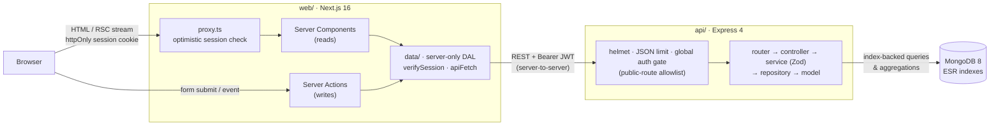

**Request flow**

1. The **browser only talks to Next.js.** It never calls the API directly, so there is no CORS setup, the session cookie is first-party, and the API URL is never exposed.
2. **`proxy.ts`** (Next 16's replacement for middleware) verifies the session cookie's signature and expiry, then redirects anonymous users to `/login`. This is an _optimistic_ check only.
3. **Server Components** read data through the **Data Access Layer** (`web/src/data`, marked `server-only`). Every DAL call runs `verifySession()` and forwards the JWT as `Authorization: Bearer` to the API.
4. **Server Actions** handle mutations. They re-validate input with Zod, call the DAL, map API errors to form errors, and `refresh()` the router so the page shows fresh data.
5. **Express** verifies the JWT again on every request (the authoritative check: a global auth middleware runs before every router, and only routes on an explicit allowlist are public). Services validate input with Zod and run index-backed MongoDB queries. All analytics are **aggregation pipelines**, so the web app only receives small result sets.
6. **Responses** use one envelope end to end: `{ isSuccess, message, body }`. Failures carry a readable message such as `"Doctor creation failed: email already exists"`; the DAL unwraps `body` or throws.

**Authentication flow**

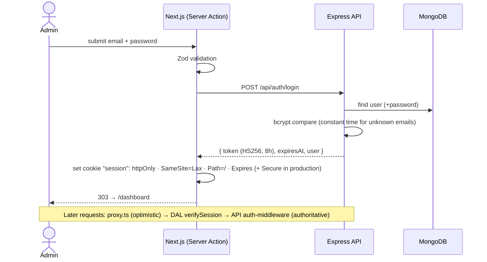

**Rendering.** Pages use **Partial Prerendering**. The app shell (sidebar, headers) is static and served instantly, while data sections stream in behind `<Suspense>` boundaries with skeletons. When filters change, the current rows stay visible and dim instead of flashing a skeleton.

**Repository layout**

```
doctor-tracker/
├─ web/      Next.js app: src/app (routes; private _components per route), src/data (server-only DAL),
│            src/actions (Server Actions), src/components (ui, data-table, charts, forms, …), e2e/
├─ api/      Express app: app.ts, src/{router,controller,service,repository,model,middleware,connector,config,utils},
│            scripts/ (seed, migrations, sync-indexes), test/, backups/ (git-ignored dumps)
├─ infra/    Standalone services: docker-compose.yml, MongoDB image with init script
└─ doc/      PRD, architecture, development plan, screenshots
```

---

## Technical decisions

### Decision 1: Next.js as a Backend-for-Frontend, with the session in an httpOnly cookie

**Context.** The spec requires a Next.js client and a separate Express server. The common approach is a client-side app that calls the API directly from the browser, keeping a JWT in `localStorage` or in a cookie set by the API. Both have real problems:

- **Token in `localStorage`:** any XSS can read and exfiltrate it.
- **Cookie set by the API:** the API lives on a different domain from the web app, so its cookie is a _third-party_ cookie. Modern browsers increasingly block those, the Next.js server can't read it to protect pages, and CORS with credentials has to be configured and kept in sync.

**Options considered**

| Option                                                                                                | Verdict                                                                                                 |
| ----------------------------------------------------------------------------------------------------- | ------------------------------------------------------------------------------------------------------- |
| Browser → API, JWT in `localStorage`                                                                  | ❌ XSS can steal the token; the server can't protect pages.                                             |
| Browser → API, API-set cookie (cross-site)                                                            | ❌ Third-party cookie blocking; CORS + credentials complexity.                                          |
| Next.js `rewrites` proxy to the API                                                                   | ⚠️ Fixes cookies, but data still loads client-side after JS, and every page needs client fetching code. |
| **Next.js as BFF: Server Components read, Server Actions write, server-to-server calls with the JWT** | ✅ Chosen                                                                                               |

**Decision.** The Next.js server is the only client of the API. On login, a Server Action exchanges the credentials for a JWT and stores it in an `httpOnly; SameSite=Lax` first-party cookie (`Secure` in production). Reads happen in Server Components and writes in Server Actions, both through a `server-only` Data Access Layer that forwards the token. This follows the official Next.js [Authentication](https://nextjs.org/docs/app/guides/authentication) and [Data Security](https://nextjs.org/docs/app/guides/data-security) guides.

**Consequences**

- ✅ **The token never reaches client JavaScript.** XSS can't exfiltrate it, and no CORS configuration is needed.
- ✅ **Defence in depth:** `proxy.ts` (optimistic redirect), then `verifySession()` in every data call and Server Action, then the global auth middleware in Express. Each layer would stop an unauthenticated request on its own.
- ✅ **Faster first paint:** data is fetched on the server, close to the API, and streamed into a prerendered shell. There is no client waterfall and no loading spinner after hydration.
- ⚠️ **Trade-off:** each request makes an extra hop (browser → Next → API). On the seeded dataset the API answers in **~13–27 ms** (median), and streaming hides the rest.
- ⚠️ **Edge case handled:** if the API rejects a still-valid-looking cookie (e.g. the user was deleted), the DAL redirects to a `/logout` route that clears the cookie. Without this, `proxy.ts` and the page would bounce the user between `/login` and `/dashboard` forever.

### Decision 2: The URL is the state store, with no Redux or client data-fetching library

**Context.** This app has three kinds of state:

- **Server data:** doctors, patients and stats.
- **Navigation state:** search, filters, sort and page.
- **Ephemeral UI state:** an open dialog, a pending button.

A global store (Redux, Zustand) or a client cache (TanStack Query, SWR) is the usual answer to _"Redux or Context?"_.

**Decision.** None of them is needed. Each kind of state goes where it belongs:

| State                                   | Where it lives                                                                   | Why                                                                                                   |
| --------------------------------------- | -------------------------------------------------------------------------------- | ----------------------------------------------------------------------------------------------------- |
| Search, filters, sort, page, date range | **URL search params**                                                            | Shareable links, back/forward and reload all work, and the server can render the right page directly. |
| Server data                             | **Server Components** (fetched per request)                                      | The server is the source of truth, so there is no client cache to invalidate or keep in sync.         |
| After a mutation                        | **Server Action + `refresh()`**                                                  | The server re-renders affected data in the same round trip as the mutation.                           |
| Instant feedback                        | **`useTransition`** (dimmed rows while loading) and **`useOptimistic`** (delete) | React 19 primitives. No hand-written loading or rollback logic.                                       |
| Dialog open, form errors                | **Local `useState`**                                                             | Belongs to one component.                                                                             |

A search keystroke updates the URL after a 300 ms debounce, inside a transition. React keeps the current table on screen (dimmed) while the server renders the next page, then swaps it in without a skeleton flash. The URL params are parsed with a **lenient Zod schema**, so a hand-edited link with invalid values falls back to defaults instead of erroring.

**Why not Redux or TanStack Query?** Both would cache data the server already owns, adding a second source of truth with its own invalidation rules. The Next.js docs note that _"Server Components cover most data-fetching needs"_; client libraries are for browser-only APIs or polled data, and this app has neither. Dropping them also means less JavaScript shipped and no duplicated loading/error logic per page.

**Trade-off.** Each filter change is a server round trip rather than a client-side filter. That's the right call for server-side pagination over a growing dataset (filtering 20 rows in the browser would be wrong anyway), and the index-backed API keeps those round trips fast.

---

## Performance & query optimization

**Indexes follow MongoDB's ESR rule** (Equality → Sort → Range), one per list query. `_id` is the sort tiebreaker, so pagination is stable and the whole sort is served by the index:

| Collection | Index                                                      | Serves                                         |
| ---------- | ---------------------------------------------------------- | ---------------------------------------------- |
| doctor     | `{ email: 1 }` unique                                      | Uniqueness, email prefix search                |
| doctor     | `{ createdAt: -1, _id: -1 }`                               | Default list, joined-date range                |
| doctor     | `{ specialization: 1, createdAt: -1, _id: -1 }`            | Specialization filter + sort                   |
| doctor     | `{ hospital: 1, createdAt: -1, _id: -1 }`                  | Hospital filter + sort, hospital list          |
| doctor     | `{ nameLower: 1, _id: 1 }`                                 | Case-insensitive name prefix search, name sort |
| patient    | `{ admissionDate: -1, _id: -1 }`                           | Default list, date range, all stats            |
| patient    | `{ doctorId: 1, admissionDate: -1, _id: -1 }`              | A doctor's patients, patients-per-doctor       |
| patient    | `{ condition: 1, admissionDate: -1, _id: -1 }`             | Condition filter + sort                        |
| patient    | `{ status: 1, admissionDate: -1, _id: -1 }`                | Status filter + sort                           |
| patient    | `{ nameLower: 1, _id: 1 }`, `{ phone: 1 }`, `{ email: 1 }` | Prefix search                                  |

**Verified with `explain('executionStats')`** on the seeded dataset (50 doctors, 2,000 patients):

| Query                             | Winning plan                                   | Docs examined / returned   |
| --------------------------------- | ---------------------------------------------- | -------------------------- |
| Doctors: default list             | `IXSCAN(createdAt_-1__id_-1)`                  | 20 / 20                    |
| Doctors: specialization + sort    | `IXSCAN(specialization_1_createdAt_-1__id_-1)` | 5 / 5                      |
| Doctors: name/email prefix search | `OR(IXSCAN(nameLower…), IXSCAN(email_1))`      | 1 / 1                      |
| Patients: condition + sort        | `IXSCAN(condition_1_admissionDate_-1__id_-1)`  | 20 / 20                    |
| Patients: a doctor's patients     | `IXSCAN(doctorId_1_admissionDate_-1__id_-1)`   | 20 / 20                    |
| Stats: admissions over time       | `IXSCAN` → `PROJECTION_COVERED` → `GROUP`      | **0** (index-covered) / 29 |

**Other practices**

- **Search is index-friendly:** names are stored in a normalized `nameLower` field and matched with an _anchored_ prefix regex. A case-insensitive `/i` regex can't use an index efficiently, and `$text` matches whole words only, so "joh" wouldn't find "John". All user input is regex-escaped.
- **Lean reads:** `find().sort().skip().limit().lean()` runs in parallel with `countDocuments` (`Promise.all`). Page size is capped at 100.
- **Aggregations:** each pipeline starts with an index-backed `$match`, and `$lookup` runs only on the top-N rows. KPI counts are parallel index-backed `countDocuments` calls rather than one `$facet`, because `$facet` sub-pipelines can't use indexes.
- **Honest analytics:** the period-over-period change is shown only when data covers the whole previous period, and the period still in progress is drawn dashed ("to date") so it isn't read as a drop.
- **Frontend:** Server Components by default, with client components only at interactive leaves. Pages are partially prerendered with streamed sections, and request-level memoization (`React.cache`) means a page fetches a doctor once even when several components need it. Recharts ships only in the dashboard route's bundle.

**Measured API latency** (median of 5 warm requests, local dev server, seeded data): list and search endpoints **13–18 ms**, stats endpoints **16–27 ms**.

---

## API reference

Base URL `http://localhost:4000/api`. Every route except `POST /auth/login` and the `GET /api` health check requires `Authorization: Bearer <jwt>`.

| Method   | Path                         | Description                                                                   |
| -------- | ---------------------------- | ----------------------------------------------------------------------------- |
| `GET`    | `/` (i.e. `/api`)            | Liveness check                                                                |
| `POST`   | `/auth/login`                | Exchange credentials for a JWT (401 on failure)                               |
| `GET`    | `/auth/me`                   | Current admin                                                                 |
| `GET`    | `/doctor/list`               | List: `offset, limit, q, specialization, hospital, from, to, sort`            |
| `POST`   | `/doctor/create`             | Create a doctor                                                               |
| `GET`    | `/doctor/getbyid?id=`        | One doctor, with its patient count                                            |
| `PUT`    | `/doctor/update/:id`         | Update the fields that are sent                                               |
| `GET`    | `/doctor/options`            | `{ _id, name }` pairs for pickers                                             |
| `GET`    | `/doctor/hospitals`          | Distinct hospital names                                                       |
| `GET`    | `/patient/list`              | List: `offset, limit, q, condition, status, gender, doctorId, from, to, sort` |
| `POST`   | `/patient/create`            | Create (`doctorId` in the body)                                               |
| `GET`    | `/patient/getbyid?id=`       | One patient                                                                   |
| `PUT`    | `/patient/update/:id`        | Update the fields that are sent (incl. reassigning the doctor)                |
| `DELETE` | `/patient/delete/:id`        | Delete a patient                                                              |
| `GET`    | `/stats/summary`             | KPIs for `from`–`to` + previous-period comparison                             |
| `GET`    | `/stats/patients-per-doctor` | Top N doctors by patients in range                                            |
| `GET`    | `/stats/admissions`          | Admissions per `day`/`week`/`month` (zero-filled, `partial` flag)             |
| `GET`    | `/stats/conditions`          | Patients per condition in range                                               |

Every response uses the same envelope. Lists return `{ data, length }` in `body`, where `length` is the total number of matches. Records are sent with their MongoDB `_id`, and a patient's `doctorId` is populated with `{ _id, name, specialization }`. Sort takes `field` or `-field` from an allowlist. Dates are `YYYY-MM-DD` and inclusive (UTC). Status codes: 200 success, 400 validation or business error (including "X not found"), 401 authentication, 404 unknown route.

```json
{ "isSuccess": true, "message": "Doctor created successfully", "body": { "_id": "…", "name": "…" } }
{ "isSuccess": false, "message": "Doctor creation failed: email already exists", "body": null }
```

---

## Testing

| Suite                                               | Scope                                                                                                                                                                                                                                                                                                                                       | Command                             |
| --------------------------------------------------- | ------------------------------------------------------------------------------------------------------------------------------------------------------------------------------------------------------------------------------------------------------------------------------------------------------------------------------------------- | ----------------------------------- |
| **API integration** (`node:test` + `fetch`, dev DB) | 46 tests: auth (401, forged token, generic failure message, operator injection), the response envelope, validation messages, duplicates, search, filters, sorting, offset pagination, date ranges, regex-injection safety, stats (zero-filled buckets, partial flag, honest comparisons). Each run tags its records and deletes only those. | `npm test`                          |
| **End-to-end** (Playwright, Chromium)               | 12 tests: login and redirects; doctor create, search with URL state, duplicate email; add, edit and delete patients (optimistic); filters; not-found; dashboard range scoping and click-through; accessible chart tables                                                                                                                    | `npm run test:e2e`                  |
| **Static checks**                                   | Type-aware ESLint, strict TypeScript, Prettier                                                                                                                                                                                                                                                                                              | `npm run lint && npm run typecheck` |

---

## Visual evidence

### Desktop

| Dashboard                                                                                        | Doctors                                                                                 |
| ------------------------------------------------------------------------------------------------ | --------------------------------------------------------------------------------------- |
|                                               | 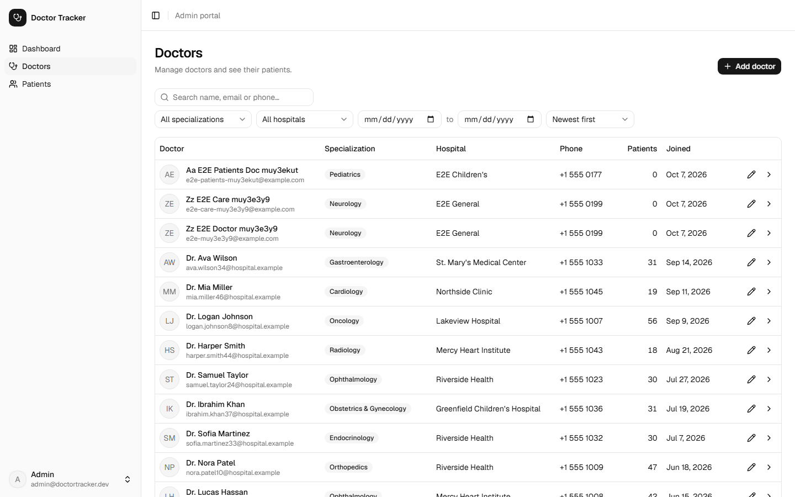                                    |
| **Doctor detail**                                                                                | **Patients (filtered)**                                                                 |
| 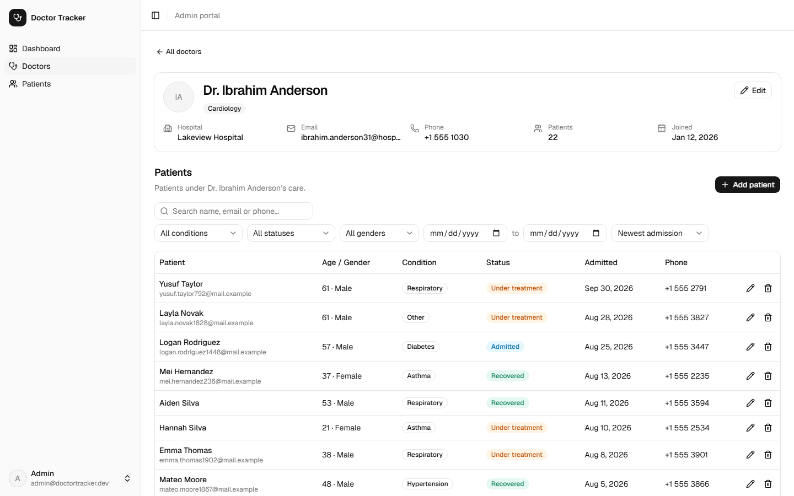                                      | 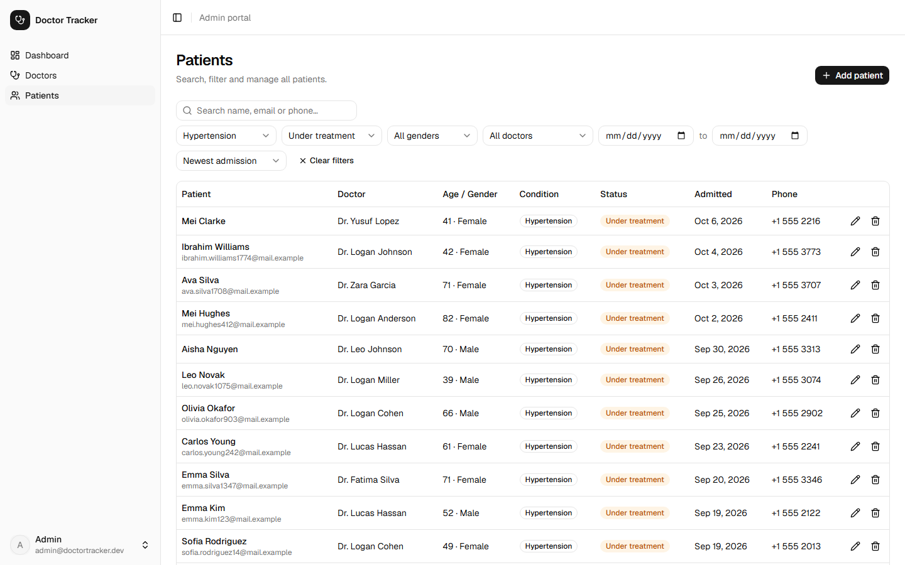 |
| **Inline validation**                                                                            | **Login**                                                                               |
| 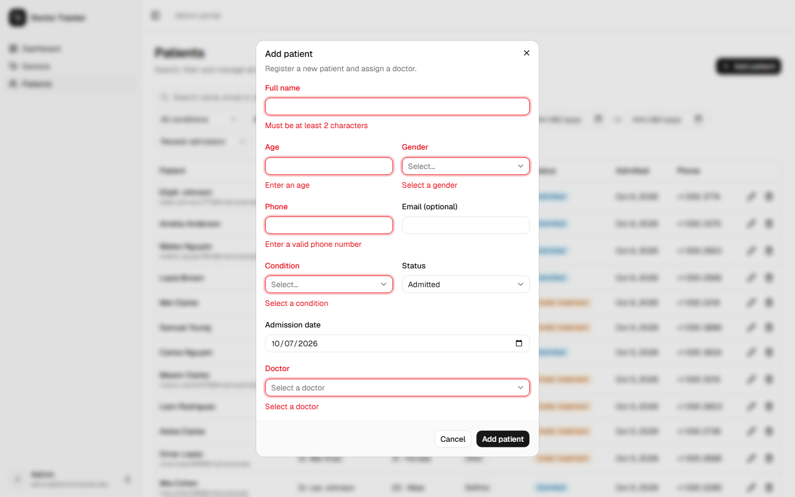 | 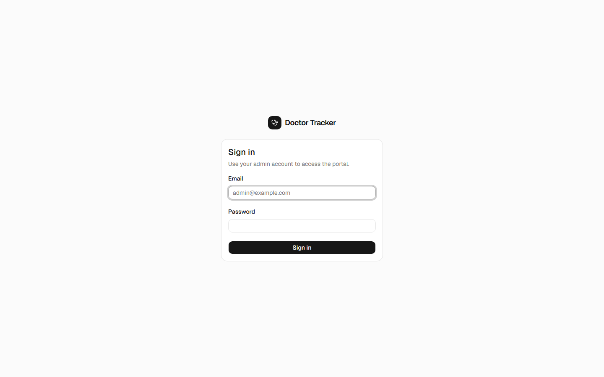                                             |

### Mobile (iPhone 13)

| Dashboard                                                 | Doctors                                               | Patients                                                | Navigation                                                         |
| --------------------------------------------------------- | ----------------------------------------------------- | ------------------------------------------------------- | ------------------------------------------------------------------ |
| 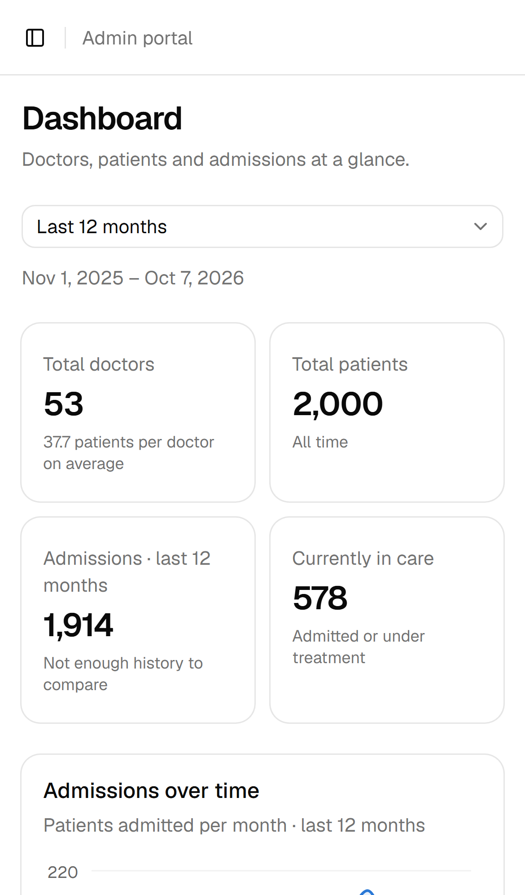 | 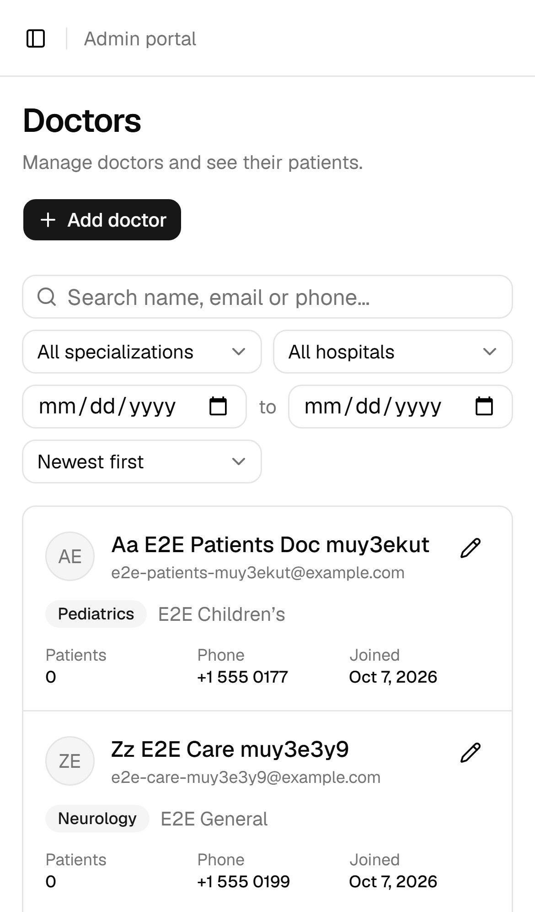 | 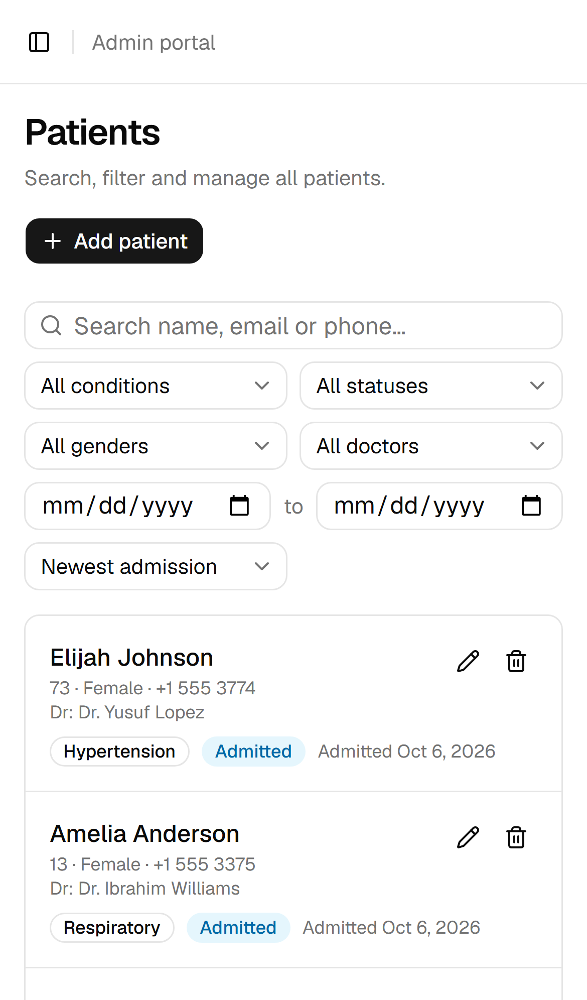 | 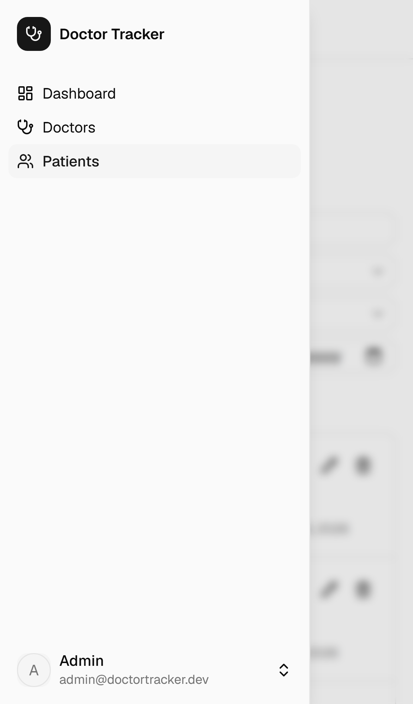 |

---

## Known limitations

- **No login rate limiting** (removed from scope for now). Before production, add a limiter keyed by IP + email, with the web server forwarding the client IP.
- **Doctors can be edited but not deleted.** This avoids orphaned patients; deleting a doctor would need a reassignment flow.
- **Offset pagination** (`skip`/`limit`) is fine at this scale. For very large collections, switch to keyset (cursor) pagination on the existing `(admissionDate, _id)` / `(createdAt, _id)` indexes.
- **Doctor pickers** load up to 1,000 doctors; beyond that they should become a server-side searchable combobox.
- **Single admin role.** Accounts are seeded, and there is no sign-up or role management.
- **Not deployed yet.** The architecture targets Vercel (web), a Node host (API) and MongoDB Atlas.

---

## Further documentation

- [`doc/PRD.md`](doc/PRD.md): product requirements, assumptions and acceptance criteria
- [`doc/architecture.md`](doc/architecture.md): detailed architecture, conventions and as-built notes
- [`doc/DEVELOPMENT_PLAN.md`](doc/DEVELOPMENT_PLAN.md): task-level plan with progress and change log
- [`infra/README.md`](infra/README.md): local MongoDB service
